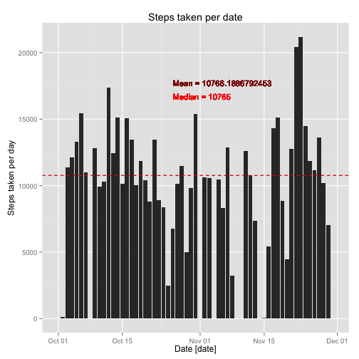
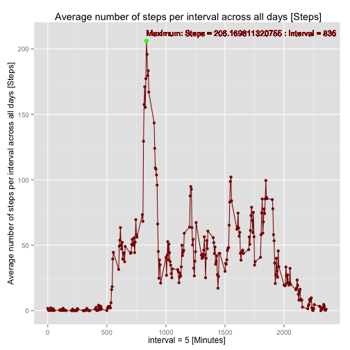
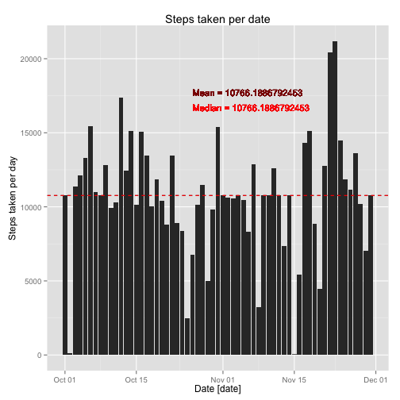
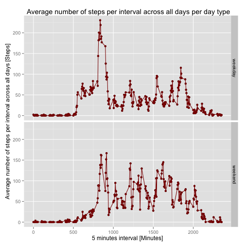

## 1. Loading and preprocessing the data


### Reading device data in csv format and formatting the data frame ###

In this case the read.csv() method was used for the appropriate data source.


```r
deviceData <- read.table("../data/activity.csv", sep = ",", header = TRUE)
```

**Setting date field as date class**, the initial class for this field
was factor, then the conversion will allow us to manipulate dates
in an easy way,


```r
deviceData <- transform(deviceData, date = as.Date(date, format = "%Y-%m-%d"))
```
The summary of the data set is


```
##      steps             date               interval     
##  Min.   :  0.00   Min.   :2012-10-01   Min.   :   0.0  
##  1st Qu.:  0.00   1st Qu.:2012-10-16   1st Qu.: 588.8  
##  Median :  0.00   Median :2012-10-31   Median :1177.5  
##  Mean   : 37.38   Mean   :2012-10-31   Mean   :1177.5  
##  3rd Qu.: 12.00   3rd Qu.:2012-11-15   3rd Qu.:1766.2  
##  Max.   :806.00   Max.   :2012-11-30   Max.   :2355.0  
##  NA's   :2304
```

**Answer. The data frame now is ready to make the next steps of the analysis.**


----------

## 2. What is mean total number of steps taken per day?

In order to answer this question we need to add the number of steps
for each day. We proceed to calculate the number of steps per date
using the aggregate function in R.


```r
stepsPerDay <- aggregate(deviceData$steps, list(deviceData$date), FUN = "sum")
colnames(stepsPerDay) <- c("date", "steps")
```

Calculating the mean and median of the total number of the steps taken
each day.


```r
meanTotalStepsPerDay <- mean(stepsPerDay$steps, na.rm = TRUE)
meanLabel <- paste("Mean =", meanTotalStepsPerDay, sep = " ")
```
The mean of the total number of the steps taken each day is 1.0766189 &times; 10<sup>4</sup>.
In other hand, the median of the total number of the steps taken each
day can be calculated with


```r
medianTotalStepsPerDay <- median(stepsPerDay$steps, na.rm = TRUE)
medianLabel <- paste("Median =", medianTotalStepsPerDay, sep = " ")
```

The median of the total number of the steps taken each day equal to
10765. The histogram si showed below, now with
the mean and median.


```r
g <- ggplot(stepsPerDay, aes(x = date, y = steps))
xrng <- stepsPerDay$date

p <- g + geom_bar(stat="identity", position="identity") +
    geom_hline(aes(yintercept = meanTotalStepsPerDay),
               colour = "dark red", linetype="dashed") +
    geom_hline(aes(yintercept = medianTotalStepsPerDay),
               colour = "red", linetype="dashed") +
    labs(x = "Date [date]") +
    labs(y = expression("Steps taken per day")) +
    labs(title = "Steps taken per date") +
    geom_text(data=NULL, aes(x = xrng[26],  y = 17500,
              label = meanLabel), colour = "dark red",
              size=4, hjust = 0, vjust = 0) +
    geom_text(data=NULL, aes(x = xrng[26],  y = 16500,
              label = medianLabel), colour = "red",
              size=4, hjust = 0, vjust = 0)

print(p)
```

 

**Answer: The mean total number of steps taken per day is 1.0766189 &times; 10<sup>4</sup>.
And the median total number of steps taken per day is 10765.**

----------

## 3. What is the average daily activity pattern? ##

The average number of steps per date per time interval can
be calculated avoiding the NA values, then, we can calculate the mean
per day for each interval, the following code subset the cases where
the steps field of the data frame have a value different of `NA`.


```r
bad <- is.na(deviceData[, 1])
completeDeviceData <- deviceData[!bad, ]

intervalStepsPerDay <- aggregate(completeDeviceData$steps,
                                 list(completeDeviceData$interval),
                                 FUN = "mean")
colnames(intervalStepsPerDay) <- c("interval", "steps")
```

Calculating the maximum number of steps for all intervals.


```r
highest <- subset(intervalStepsPerDay, steps == max(steps))
maximumStepsLabel <- paste("Maximum: Steps =", highest$steps, ":",
                           "Interval =", highest$interval)
```

Plotting the results


```r
g <- ggplot(intervalStepsPerDay, aes(x = interval, y = steps))
p <- g + geom_point(color = "dark red") +
  geom_line(color = "dark red") +
    labs(x = "interval = 5 [Minutes]") +
    labs(y =
             expression("Average number of steps per interval across all days [Steps]")) +
    labs(title =
             " Average number of steps per interval across all days [Steps]") +
    geom_point(data = highest, size = 3, colour = "green") +
    geom_text(data=NULL, aes(x = 835,  y = 210,
    label = maximumStepsLabel), colour = "dark red",
    size=4, hjust = 0, vjust = 0)

print(p)
```

 

The summary of the steps taken per day per interval is


```
##     interval          steps        
##  Min.   :   0.0   Min.   :  0.000  
##  1st Qu.: 588.8   1st Qu.:  2.486  
##  Median :1177.5   Median : 34.113  
##  Mean   :1177.5   Mean   : 37.383  
##  3rd Qu.:1766.2   3rd Qu.: 52.835  
##  Max.   :2355.0   Max.   :206.170
```

**Answer: The pattern present in the average daily activity have a big
  quantity of steps at the interval between 750 and 1000 minutes,
  after that time is reduced in a half. With the The maximum value at
  (835, 206.1698113).**

----------

## 4. Imputing missing values

We can calculate and report the total number of missing values in the
dataset (i.e. the total number of rows with `NA`)


```r
numberRowsWithNA <- nrow(deviceData[!complete.cases(deviceData), ])
```

**The number of NA values in the steps field is 2304.**

Now, we can design an strategy in order to substitute the `NA` values
with the mean for the 5-minute interval. A new data set was create but
with the missing data filled in with the filling and substitute
process strategy.


```r
newDeviceData <- deviceData

for (i in 1:nrow(newDeviceData)) {
        if (is.na(newDeviceData[i, 1])) {
                interval <- newDeviceData[i, 3]
                newDeviceData[i, 1] <-
                        intervalStepsPerDay[intervalStepsPerDay$interval == interval, 2]
        }
}
```

The histogram si showed below, now with the mean and
median. Calculating the number of steps per date


```r
newStepsPerDay <- aggregate(newDeviceData$steps, list(newDeviceData$date), FUN = "sum")
colnames(newStepsPerDay) <- c("date", "steps")
```

Calculating the mean and median of the total number of the steps taken
each day.


```r
newMeanTotalStepsPerDay <- mean(newStepsPerDay$steps, na.rm = TRUE)
meanLabel <- paste("Mean =", newMeanTotalStepsPerDay, sep = " ")
```

The mean of the total number of the steps taken each day is 1.0766189 &times; 10<sup>4</sup>.

The median of the total number of the steps sttaken each day is
calculated with


```r
newMedianTotalStepsPerDay <- median(newStepsPerDay$steps, na.rm = TRUE)
medianLabel <- paste("Median =", newMedianTotalStepsPerDay, sep = " ")
```

The mean of the total number of the steps taken each day is 1.0766189 &times; 10<sup>4</sup>.

The histogram si showed below,


```r
g <- ggplot(newStepsPerDay, aes(x = date, y = steps))
xrng <- newStepsPerDay$date

p <- g + geom_bar(stat="identity", position="identity") +
    geom_hline(aes(yintercept = newMeanTotalStepsPerDay),
               colour = "dark red", linetype="dashed") +
                   geom_hline(aes(yintercept = newMedianTotalStepsPerDay),
                   colour = "red", linetype="dashed") +
                   labs(x = "Date [date]") +
                   labs(y = expression("Steps taken per day")) +
                   labs(title = "Steps taken per date") +
                   geom_text(data=NULL,
                   aes(x = xrng[26],  y = 17500,
                   label = meanLabel), colour = "dark red",
                   size=4, hjust = 0, vjust = 0) +
                   geom_text(data=NULL, aes(x = xrng[26],  y = 16500,
                   label = medianLabel), colour = "red",
                   size=4, hjust = 0, vjust = 0)


print(p)
```

 

**The mean total number of steps taken per day is 1.0766189 &times; 10<sup>4</sup>.
And the median total number of steps taken
  per day is 1.0766189 &times; 10<sup>4</sup>. Actually, the values are very
  close to the case with `NA` respectively, the impact of the substitution is
  minimal. The imputing missing data actions didn't have impact in
  calculations.**

----------

## 5. Are there differences in activity patterns between weekdays and weekends?

We create a new factor variable in the dataset with two levels
**weekday** and **weekend** indicating whether a given date is a
weekday or weekend day.


```r
dayLevel <- character(length = nrow(newDeviceData))

for (i in 1:nrow(newDeviceData)) {
        if (isWeekend(as.Date(newDeviceData[i, 2]))) {
                dayLevel[i] <- "weekend"
        } else {
                dayLevel[i] <- "weekday"
        }
}

dayLevel <- factor(dayLevel, order=TRUE, levels=c("weekday",
                                             "weekend"))
newDeviceData <- cbind(newDeviceData, dayLevel)
```

The new data frame summary is


```
##      steps             date               interval         dayLevel    
##  Min.   :  0.00   Min.   :2012-10-01   Min.   :   0.0   weekday:12960  
##  1st Qu.:  0.00   1st Qu.:2012-10-16   1st Qu.: 588.8   weekend: 4608  
##  Median :  0.00   Median :2012-10-31   Median :1177.5                  
##  Mean   : 37.38   Mean   :2012-10-31   Mean   :1177.5                  
##  3rd Qu.: 27.00   3rd Qu.:2012-11-15   3rd Qu.:1766.2                  
##  Max.   :806.00   Max.   :2012-11-30   Max.   :2355.0
```

A panel plot with a time series for the 5-minute interval (x-axis) and
the average number of steps taken averaged across all weekday or
weekend days (y-axis) is required, then we proceed to process the
steps taken data averaging it respect to the 5-minute interval and the
different ("weekday and weekend") levels


```r
newIntervalStepsPerDay <- aggregate(newDeviceData$steps,
                                    by = list(newDeviceData$interval,
                                         newDeviceData$dayLevel), FUN
                                    = "mean")
colnames(newIntervalStepsPerDay) <- c("interval", "dayLevel", "steps")
```

Plotting the number of steps taken, averaged across all weekday days or
weekend days.


```r
g <- qplot(interval, steps, data = newIntervalStepsPerDay, facets =
          dayLevel ~ .)
p <- g + geom_point(color = "dark red") +
    geom_line(color = "dark red") +
    labs(x = "5 minutes interval [Minutes]") +
    labs(y =
    expression("Average number of steps per interval across all days [Steps]")) +
    labs(title =
             " Average number of steps per interval across all days per day type")

print(p)
```

 

The summary of the new data frame is


```
##     interval         dayLevel       steps        
##  Min.   :   0.0   weekday:288   Min.   :  0.000  
##  1st Qu.: 588.8   weekend:288   1st Qu.:  2.047  
##  Median :1177.5                 Median : 28.133  
##  Mean   :1177.5                 Mean   : 38.988  
##  3rd Qu.:1766.2                 3rd Qu.: 61.263  
##  Max.   :2355.0                 Max.   :230.378
```

**The average number of steps per interval is lower at
  weekends. In the same way, at weekends the raising in the number of
  steps begin later than in weekdays, and, in general at weekends, the
  number of steps are compressed in less intervals, beginning later
  and finish earlier.**


*******

`Coded in Emacs24 + ESS + Polymode + Markdown modes. Sergio-Feliciano
Mendoza-Barrera Oct. 17, 2014`

<!-- EOF -->
