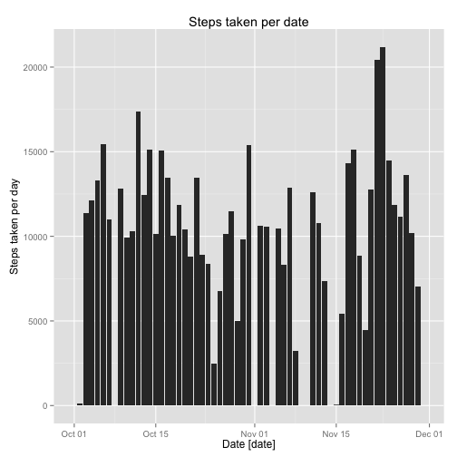

**Sergio-Feliciano Mendoza-Barrera Oct. 17, 2014**

## 1. Loading and preprocessing the data


Reading device data in csv format, in this case the read.csv() method was
used for the appropriate data source.


```r
deviceData <- read.table("../data/activity.csv", sep = ",", header = TRUE)
```

**Setting date field as date class**, the initial class for this field
was factor, then the conversion will allow us to manipulate dates
in an easy way,


```r
deviceData <- transform(deviceData, date = as.Date(date, format = "%Y-%m-%d"))
```
The summary of the data set is


```
##      steps             date               interval     
##  Min.   :  0.00   Min.   :2012-10-01   Min.   :   0.0  
##  1st Qu.:  0.00   1st Qu.:2012-10-16   1st Qu.: 588.8  
##  Median :  0.00   Median :2012-10-31   Median :1177.5  
##  Mean   : 37.38   Mean   :2012-10-31   Mean   :1177.5  
##  3rd Qu.: 12.00   3rd Qu.:2012-11-15   3rd Qu.:1766.2  
##  Max.   :806.00   Max.   :2012-11-30   Max.   :2355.0  
##  NA's   :2304
```

### Answer. The data frame now is ready to make the next steps of the analysis. ###

## 2. What is mean total number of steps taken per day?

In order to answer this question we need to add the number of steps
for each day. We proceed to calculate the number of steps per date:


```r
stepsPerDay <- aggregate(deviceData$steps, list(deviceData$date), FUN = "sum")
colnames(stepsPerDay) <- c("date", "steps")
```

The code and the histogram is showed below,


```r
g <- ggplot(stepsPerDay, aes(x = date, y = steps))

p <- g + geom_bar(stat="identity", position="identity") +
    labs(x = "Date [date]") +
    labs(y = expression("Steps taken per day")) +
    labs(title = "Steps taken per date")

print(p)
```

 

Calculating the mean and median of the total number of the steps taken
each day. The mean of the total number of the steps taken each day is


```r
meanTotalStepsPerDay <- mean(stepsPerDay$steps, na.rm = TRUE)
meanLabel <- paste("Mean =", meanTotalStepsPerDay, sep = " ")
```

The median of the total number of the steps sttaken each day is
calculated with


```r
medianTotalStepsPerDay <- median(stepsPerDay$steps, na.rm = TRUE)
medianLabel <- paste("Median =", medianTotalStepsPerDay, sep = " ")
```

### Answer: The mean total number of steps taken per day is 1.0766189 &times; 10<sup>4</sup>. And the median total number of steps taken per day is 10765.###

The histogram si showed below, now with the mean and median.


```r
g <- ggplot(stepsPerDay, aes(x = date, y = steps))
xrng <- stepsPerDay$date

p <- g + geom_bar(stat="identity", position="identity") +
    geom_hline(aes(yintercept = meanTotalStepsPerDay),
               colour = "dark red", linetype="dashed") +
    geom_hline(aes(yintercept = medianTotalStepsPerDay),
               colour = "red", linetype="dashed") +
    labs(x = "Date [date]") +
    labs(y = expression("Steps taken per day")) +
    labs(title = "Steps taken per date") +
    geom_text(data=NULL, aes(x = xrng[26],  y = 17500,
              label = meanLabel), colour = "dark red",
              size=4, hjust = 0, vjust = 0) +
    geom_text(data=NULL, aes(x = xrng[26],  y = 16500,
              label = medianLabel), colour = "red",
              size=4, hjust = 0, vjust = 0)

print(p)
```

 

## 3. What is the average daily activity pattern? ##

The average number of steps per date per time interval can
be calculated avoiding the NA values, then, we can calculate the mean
per day for each interval


```r
bad <- is.na(deviceData[, 1])
completeDeviceData <- deviceData[!bad, ]

intervalStepsPerDay <- aggregate(completeDeviceData$steps,
                                 list(completeDeviceData$interval),
                                 FUN = "mean")
colnames(intervalStepsPerDay) <- c("interval", "steps")
```

Calculating the maximum number of steps for all intervals.


```r
highest <- subset(intervalStepsPerDay, steps == max(steps))
maximumStepsLabel <- paste("Maximum: Steps =", highest$steps, ":",
                           "Interval =", highest$interval)
```

Plotting the results


```r
g <- ggplot(intervalStepsPerDay, aes(x = interval, y = steps))
p <- g + geom_point(color = "dark red") +
  geom_line(color = "dark red") +
    labs(x = "5 minutes interval [Minutes]") +
    labs(y =
             expression("Average number of steps per interval across all days [Steps]")) +
    labs(title =
             " Average number of steps per interval across all days [Steps]") +
    geom_point(data = highest, size = 3, colour = "green") +
    geom_text(data=NULL, aes(x = 835,  y = 210,
    label = maximumStepsLabel), colour = "dark red",
    size=4, hjust = 0, vjust = 0)

print(p)
```

 

### Answer: The pattern present in the average daily activity have a big quantity of steps at the interval between 750 and 1000 minutes, after that time is reduced in a half. ###

### The maximum value is (835, 206.1698113). ###

## 4. Imputing missing values

1. Calculate and report the total nThe maximum value is (835, 206.1698113).umber of missing values in the
   dataset (i.e. the total number of rows with `NA`)


```r
numberRowsWithNA <- nrow(deviceData[!complete.cases(deviceData), ])
```
The number of NA values in the steps field is 2304

2. Devise a strategy for filling in all of the missing values in
the dataset. The strategy does not need to be sophisticated. For
example, you could use the mean/median for that day, or the mean
for that 5-minute interval, etc.

### The selected strategy was substitute each NA value with mean for the specific interval of the row. ###

3. Create a new dataset that is equal to the original dataset but
with the missing data filled in.


```r
newDeviceData <- deviceData

for (i in 1:nrow(newDeviceData)) {
        if (is.na(newDeviceData[i, 1])) {
                interval <- newDeviceData[i, 3]
                newDeviceData[i, 1] <-
                        intervalStepsPerDay[intervalStepsPerDay$interval == interval, 2]
        }
}
```

4. Make an histogram of the total number of steps taken each day and
calculate and report the **mean** and **median** total number of
steps taken per day. Do these values differ from the estimates from
the first part of the assignment? What is the impact of imputing
missing data on the estimates of the total daily number of steps?

The histogram si showed below, now with the mean and
median. Calculating the number of steps per date:


```r
newStepsPerDay <- aggregate(newDeviceData$steps, list(newDeviceData$date), FUN = "sum")
colnames(newStepsPerDay) <- c("date", "steps")
```

Calculating the mean and median of the total number of the steps taken
each day. The mean of the total number of the steps taken each day is


```r
newMeanTotalStepsPerDay <- mean(newStepsPerDay$steps, na.rm = TRUE)
meanLabel <- paste("Mean =", newMeanTotalStepsPerDay, sep = " ")
```

The median of the total number of the steps sttaken each day is
calculated with


```r
newMedianTotalStepsPerDay <- median(newStepsPerDay$steps, na.rm = TRUE)
medianLabel <- paste("Median =", newMedianTotalStepsPerDay, sep = " ")
```

### Answer: The mean total number of steps taken per day is 1.0766189 &times; 10<sup>4</sup>. And the median total number of steps taken per day is 1.0766189 &times; 10<sup>4</sup>. And the values are very close each other respectively, the impact of the substitution is minimal. ###

The histogram si showed below,


```r
g <- ggplot(newStepsPerDay, aes(x = date, y = steps))
xrng <- newStepsPerDay$date

p <- g + geom_bar(stat="identity", position="identity") +
    geom_hline(aes(yintercept = newMeanTotalStepsPerDay),
               colour = "dark red", linetype="dashed") +
                   geom_hline(aes(yintercept = newMedianTotalStepsPerDay),
                   colour = "red", linetype="dashed") +
                   labs(x = "Date [date]") +
                   labs(y = expression("Steps taken per day")) +
                   labs(title = "Steps taken per date") +
                   geom_text(data=NULL,
                   aes(x = xrng[26],  y = 17500,
                   label = meanLabel), colour = "dark red",
                   size=4, hjust = 0, vjust = 0) +
                   geom_text(data=NULL, aes(x = xrng[26],  y = 16500,
                   label = medianLabel), colour = "red",
                   size=4, hjust = 0, vjust = 0)


print(p)
```

 

### Answer: Now we have a better approximation when we make a substitution of NA values with the mean of each interval for each day in general the median and the mean are the same, the imputing missing data actions didn't have impact in calculations ###

## 5. Are there differences in activity patterns between weekdays and weekends?

For this part the `weekdays()` function may be of some help here. And using
the dataset with the filled-in missing values for this part.

1. Create a new factor variable in the dataset with two levels
**weekday** and **weekend** indicating whether a given date is a
 weekday or weekend day.


```r
dayLevel <- character(length = nrow(newDeviceData))

for (i in 1:nrow(newDeviceData)) {
        if (isWeekend(as.Date(newDeviceData[i, 2]))) {
                dayLevel[i] <- "weekend"
        } else {
                dayLevel[i] <- "weekday"
        }
}

dayLevel <- factor(dayLevel, order=TRUE, levels=c("weekday",
                                             "weekend"))
newDeviceData <- cbind(newDeviceData, dayLevel)

print(summary(newDeviceData))
```

```
##      steps             date               interval         dayLevel    
##  Min.   :  0.00   Min.   :2012-10-01   Min.   :   0.0   weekday:12960  
##  1st Qu.:  0.00   1st Qu.:2012-10-16   1st Qu.: 588.8   weekend: 4608  
##  Median :  0.00   Median :2012-10-31   Median :1177.5                  
##  Mean   : 37.38   Mean   :2012-10-31   Mean   :1177.5                  
##  3rd Qu.: 27.00   3rd Qu.:2012-11-15   3rd Qu.:1766.2                  
##  Max.   :806.00   Max.   :2012-11-30   Max.   :2355.0
```

2. Make a panel plot containing a time series plot (i.e. `type =
"l"`) of the 5-minute interval (x-axis) and the average number of
steps taken, averaged across all weekday days or weekend days
(y-axis). The plot should look something like the following, which
was created using **simulated data**


```r
newIntervalStepsPerDay <- aggregate(newDeviceData$steps,
                                    by = list(newDeviceData$interval,
                                         newDeviceData$dayLevel), FUN
                                    = "mean")
colnames(newIntervalStepsPerDay) <- c("interval", "dayLevel", "steps")
```

Plotting the number of steps taken, averaged across all weekday days or
weekend days.


```r
g <- qplot(interval, steps, data = newIntervalStepsPerDay, facets =
          dayLevel ~ .)
p <- g + geom_point(color = "dark red") +
    geom_line(color = "dark red") +
    labs(x = "5 minutes interval [Minutes]") +
    labs(y =
    expression("Average number of steps per interval across all days [Steps]")) +
    labs(title =
             " Average number of steps per interval across all days per day type")

print(p)
```

 

### Answer. The average number of steps per interval is lower at weekends. In the same way, at weekends the raising in the number of steps begin later than in weekdays, and, in general at weekends, the number of steps are compressed in less intervals, beginning later and finish earlier. ###
